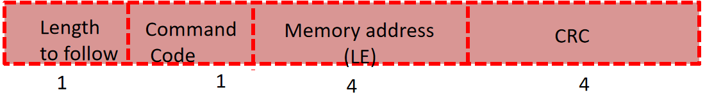

# Bootloader

## I. Giới thiệu chung
### 1. Tài liệu
- Software : keilc + stm32cubemx + flash_loader_demo
- Hardware : STM32F407VGTx / Nucleo-F446 
- Video : [youtube playlist](https://www.youtube.com/playlist?list=PL831drV1RoWvZBBmt1j7KcPA_z4U1zARC)
- Document : AN2606
### 2. Giới thiệu về bootloader
- Bootloader chỉ là một đoạn mã nhỏ được lưu trữ trong bộ nhớ flash hoặc ROM của MCU để hoạt động như một trình tải ứng dụng cũng như một cơ chế để cập nhật các ứng dụng bất cứ khi nào cần.

## II. tổ chức bộ nhớ trong vi điều khiển STM32F407VGTx
### 1. Tổ chức bộ nhớ

- SRAM : (SRAM1 : 112KB,  SRAM2 : 16KB)
\- Size 128KB \
\- Begins @ 0x2000_0000 \
\- Ends @ 0x2001_FFFF \
\- Được sử dụng để lưu trữ dữ liệu toàn cục của ứng dụng, các biến tĩnh Cũng được sử dụng cho Stack và Heap Mục đích dễ bay hơi \
\- Có thể thực thi mã từ bộ nhớ này

- Flash
\- Size : 1Mbyte \
\- Start : 0x0800 0000 
\- End : 0x080F FFFF 

- ROM
\- Size is 30KB \
\- Begins @ 0x1FFF_0000 \
\- Ends @ 0x1FFF_77FF \
\- Tất cả các MCU ST đều lưu trữ Bootloader trong bộ nhớ này \
\- Bộ nhớ này chỉ đọc \
\- Theo mặc định, MCU sẽ không thực thi bất kỳ mã nào từ bộ nhớ này nhưng bạn có thể cấu hình MCU để khởi động hoặc thực thi bootloader từ bộ nhớ này.- OTP
- Backup RAM
- Option byte memory 
\- vùng nhớ phụ thộc vào chế độ BOOT
### 2. Boot Configuration 

- Mặc định thì BOOT0 sẽ đặt ở mức thấp Flash memory sẽ được ánh xạ vào khu vực Option byte memory  
- đối với MCU dự trên ARM Cortex M
\- Giá trị địa chỉ @0x0000_0000 chứa địa trỉ MSP(Main Stack Pointer) \
\- Giá trị địa chỉ @0x0000_0004 chứa Reset_handler \
\- vector table ...
- Trong STM32 Microcontroller
\- địa chỉ 0x0800_0000 chứa giá trị MSP(Main Stack Pointer) sẽ được ánh xạ vào @0x0000_0000 \
\- Giá trị địa chỉ @0x0800_0004 chứa Reset_handler sẽ được ánh xạ @0x0000_0004 
\- ...
## II. Tự Tạo bootloader
### 1. Vấn đề
- Tạo boodloader 
\- vị trí bootloader [section 0 + section 1] của sram(0x0800_0000)
\- section 2 - section 7 lưu code

- Kết nối từ host với stm32f4

### 2. Tạo khu vực USER_APP trên keilc
- tạo project chứa chương trình USER_APP
- sau đó cấu hình địa chỉ lưu code

### 4. Check CRC

### 3. Bootloader Command
#### BL_GET_VER command

- Giá trị các trường
  - Tổng Byte của gói tin: 6 
  - Command code : 0x51
  - Length to follow : 5 
- Reply: 1 Byte: Version của bootloader
#### BL_GET_HELP

- Giá trị các trường
  - Tổng Byte của gói tin: 6 
  - Command code : 0x52
  - Length to follow : 5 
- Reply: hiển thị tất cả các lệnh 
#### BL_GET_CID

- Giá trị các trường
  - Tổng Byte của gói tin: 6 
  - Command code : 0x53
  - Length to follow : 5 
- Reply: 2 Byte chứa chip id của 
#### BL_GET_RDP_STATUS

- Giá trị các trường
  - Tổng Byte của gói tin: 6 
  - Command code : 0x54
  - Length to follow : 5 
- Reply:
#### BL_GO_TO_ADDR

- Giá trị các trường
  - Tổng Byte của gói tin: 10 
  - Command code : 0x55
  - Length to follow : 5 
- Reply: 1 Byte chứa trạng thái
#### BL_FLASH_ERASE

- Giá trị các trường
  - Tổng Byte của gói tin: 6 
  - Command code : 0x53
  - Length to follow : 5 
- Reply:
#### BL_MEM_WRITE

- Giá trị các trường
  - Tổng Byte của gói tin: 6 
  - Command code : 0x53
  - Length to follow : 5 
- Reply:
#### BL_READ_SECTOR_P_STATUS

